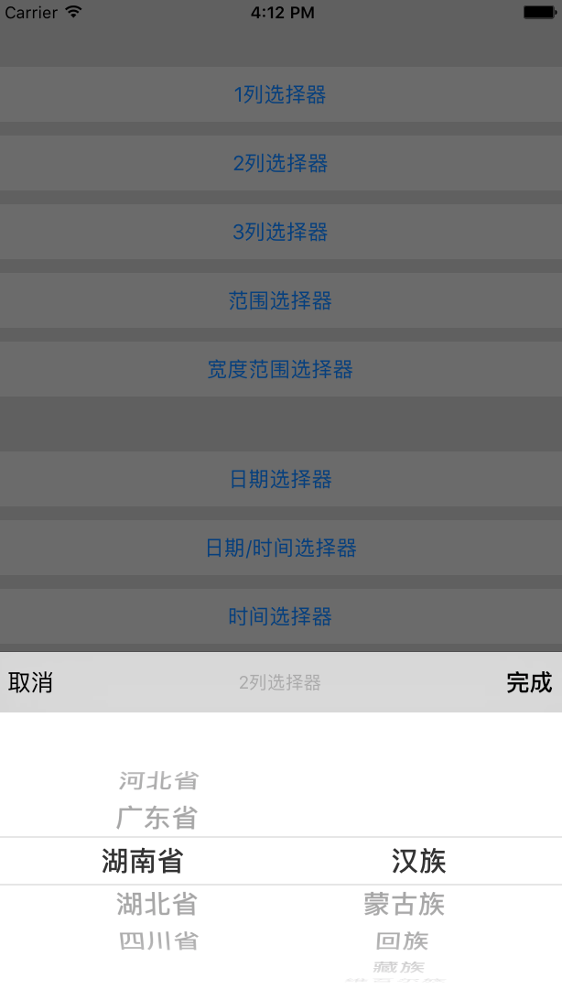

# XXPickerView
XXPickerView 是 ActionSheet 样式的 UIPickerView.


    
# 如何安装

##1.使用CocoaPods安装
推荐使用这种安装方式。
step1:添加下面一条语句到Podfile:

````
pod 'XXPickerView','~> 1.0.0'
````
step2:导入.h文件

````objc
#import "XXPickerView.h"
````

##2.手动安装
step1:直接下载XXPickerView文件夹，拖放到工程中。
step2:导入.h文件

````objc
#import "XXPickerView.h"
````

# 如何使用

2列选择器
````objc
    XXPickerView *picker = [[XXPickerView alloc] initWithTitle:@"2列选择器" delegate:self];
    [picker setTag:2];
    [picker setTitlesForComponents:@[@[@"河北省", @"广东省", @"湖南省", @"湖北省", @"四川省"],
                                     @[@"汉族", @"蒙古族", @"回族", @"藏族", @"维吾尔族"]]];
    [picker selectIndexes:@[@2,@3] animated:YES];
    [picker show];
````
XXPickerView Delegate:
````objc
-(void)xxPickerView:(XXPickerView *)pickerView didSelectTitles:(NSArray *)titles selectedRows:(NSArray *)rows
{
    switch (pickerView.tag)
    {
        case 1:
            [_buttonSingle setTitle:[titles componentsJoinedByString:@" - "] forState:UIControlStateNormal];
            NSLog(@"选择的各滚轮行号%@",rows);
            break;
        case 2:
            [_buttonDouble setTitle:[titles componentsJoinedByString:@" - "] forState:UIControlStateNormal];
            NSLog(@"选择的各滚轮行号%@",rows);
            break;
        case 3:
            [_buttonTriple setTitle:[titles componentsJoinedByString:@" - "] forState:UIControlStateNormal];
            NSLog(@"选择的各滚轮行号%@",rows);
            break;
        case 4:
            [_buttonRange setTitle:[titles componentsJoinedByString:@" - "] forState:UIControlStateNormal];
            NSLog(@"选择的各滚轮行号%@",rows);
            break;
        case 5:
            [_buttonTripleSize setTitle:[titles componentsJoinedByString:@" - "] forState:UIControlStateNormal];
            NSLog(@"选择的各滚轮行号%@",rows);
            break;
            
        default:
            break;
    }
}
````

详细使用请查看XXPickerViewDemo.

# 兼容性
- 本项目和示例程序是使用Xcode8开发
- 支持iOS7.0以上版本（包含iOS7.0）。

# 更新日志
##v1.0.0 (2017/01/11)
- 添加CocoaPods支持
- 增加XXPickerViewDemo.
